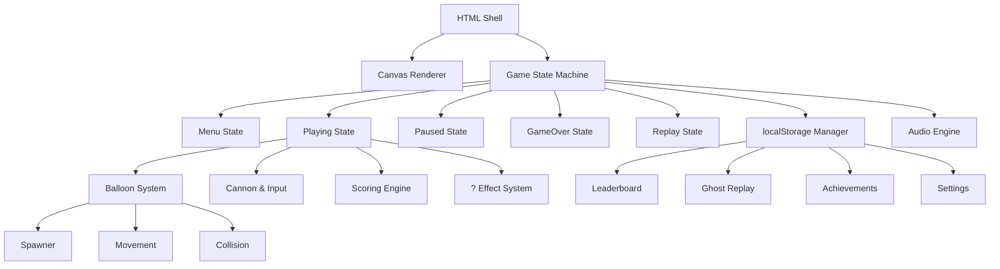

## Goal Capsule

- **Objective:** Build a standalone web-based balloon-popping score-attack game inspired by 大富翁4's 七彩气球 mini-game. Single HTML5 Canvas file with modern flat design, responsive for desktop + mobile. The entire experience revolves around chasing high scores.
- **Product Authority:** Casual web gamers looking for a quick, fun browser game.
- **Stop Conditions:** All 30 requirements (R1–R30) verified. All 5 acceptance examples (AE1–AE6) pass. Game runs in Chrome, Firefox, Safari, Edge on desktop and mobile viewports.
- **Execution Profile:** Single-file implementation. No build step. Open `index.html` in browser to test.
- **Tail Ownership:** Creator retains ownership post-launch.

## Product Contract

### Summary

A single-file HTML5 Canvas web game where players control a cannon at the bottom of the screen and pop balloons floating upward across 4 lanes. The game is built around score-attack modes (multiple timed modes, challenge modes), a localStorage leaderboard, ghost replays of best runs, and an achievement system. Modern flat design, responsive for desktop (mouse/keyboard) and mobile (touch).

### Key Decisions

- **Pure HTML5 Canvas, zero dependencies.** Single file, instant deploy, no build step. The original game used simple 2D sprites that translate directly to canvas drawing.
- **localStorage for persistence.** Leaderboards, ghost replays, achievements, and settings all stored locally. No server required. Scores are device-local.
- **Ghost replay via input sequence recording.** Store timestamped input events (position + fire), re-simulate on playback. Lightweight storage but requires deterministic game logic. Desktop-only for v1 (touch input recording adds complexity).
- **"? " balloons as core chaos element.** The original game's "?" balloons (×2, ÷2, speed up/down, timer-to-0, score-to-0) are kept as a defining mechanic. Each mode handles these wild-card effects.
- **Bomb balloons as risk/reward.** Hitting a bomb ends the current run. Bombs move faster than normal balloons. Players must decide whether to clear lanes or focus on high-value targets.

### Requirements

#### Core Gameplay

- R1. The game presents a play area with 4 vertical lanes. Balloons float upward from the bottom at varying speeds.
- R2. The player controls a cannon positioned at the bottom of the screen. The cannon can move left/right and fire upward.
- R3. Balloons are numbered 1–9. Higher-numbered balloons are smaller, move faster, and are harder to hit. Each popped balloon awards its face value as points.
- R4. "?" balloons appear randomly with one of 6 effects: score ×2, score ÷2, speed up all balloons, speed down all balloons, timer jumps to 0, or score resets to 0.
- R5. Bomb balloons move faster than normal balloons. Hitting a bomb ends the current run immediately.
- R6. The game supports desktop controls (mouse movement + click/keyboard arrow keys + space) and mobile controls (touch drag + tap to fire).
- R7. A 4-lane layout is maintained. The cannon can only fire into the lane it is currently aligned with.

#### Game Modes

- R8. **Classic (15s):** 15-second timed mode, faithful to the original. Score converts to tokens at 1:1.
- R9. **Blitz (10s):** 10-second timed mode with faster balloon spawn rates.
- R10. **Marathon (30s):** 30-second timed mode with escalating difficulty — balloon speed and spawn rate increase every 10 seconds.
- R11. **Zen:** No timer, no bombs. Balloons spawn indefinitely. Player plays until they choose to stop. No score recorded to leaderboard.
- R12. **Challenge modes:** A set of scenario-based challenges with specific goals (e.g., "reach 500 points", "pop only 7+ balloons", "survive 20s with ×2 active"). At least 5 challenges at launch.

#### Leaderboard & Scoring

- R13. Each timed mode (Classic, Blitz, Marathon) maintains a separate top-10 leaderboard stored in localStorage.
- R14. Leaderboard entries store: score, date, mode, and a reference to the ghost replay data.
- R15. A stats dashboard displays: total games played, total balloons popped, highest score per mode, total time played, and achievement progress.

#### Ghost Replay

- R16. The game records input sequences (timestamp, cannon position, fire event) during each run.
- R17. Ghost replays can be played back on the game screen, showing the cannon moving and firing exactly as recorded.
- R18. Ghost replay playback is desktop-only for v1. Mobile runs do not record ghost data.
- R19. A "Watch Best Run" option plays back the highest-scoring run for each mode.

#### Achievements

- R20. The game includes an achievement system with at least 15 achievements spanning: score milestones, pop streaks, mode completion, and challenge completion.
- R21. Achievements are stored in localStorage and displayed on a dedicated achievements screen.
- R22. Achievements unlock visual rewards: new cannon skins and balloon color themes.

#### Visual Design

- R23. Modern flat design with bright, saturated colors. No pixel art, no gradients — clean geometric shapes.
- R24. The cannon is rendered as a simple geometric shape (trapezoid + barrel). Balloons are circles with centered numbers. Bombs are circles with a fuse icon. "?" balloons have a "?" label.
- R25. Pop effects include: balloon shrinks and fades, small particle burst, score number floats upward briefly.
- R26. The UI includes: mode selector, score display, timer display (for timed modes), pause button, and a settings gear icon.
- R27. The game is responsive: canvas scales to fit the viewport while maintaining aspect ratio. Minimum supported width: 320px. Maximum: 1920px.

#### Audio

- R28. Sound effects for: balloon pop, bomb hit, mode start, timer warning (last 3 seconds), achievement unlock, and UI button clicks.
- R29. Audio is muted by default. A toggle in settings enables/disables sound.
- R30. All audio is generated via Web Audio API (no external files). Simple synthesized tones and effects.

### Acceptance Examples

- AE1. **Classic mode bomb interaction**
  - **Given:** Player is in Classic (15s) mode with 8 seconds remaining and score 120.
  - **When:** Player fires at a bomb balloon.
  - **Then:** Game ends immediately. Final score 120 is recorded. Game-over screen shows score, option to retry or watch replay.

- AE2. **×2 effect stacking**
  - **Given:** Player has score 50 in Classic mode.
  - **When:** Player pops a "?" balloon that triggers ×2, then immediately pops a numbered-7 balloon.
  - **Then:** Score becomes (50 × 2) + 7 = 107. The ×2 applies to the current score before the 7 is added.

- AE3. **Score-to-0 effect**
  - **Given:** Player has score 300 in Marathon mode.
  - **When:** Player pops a "?" balloon that triggers score-to-0.
  - **Then:** Score resets to 0. Player continues playing with score 0.

- AE4. **Leaderboard persistence**
  - **Given:** Player completes Classic mode with score 250.
  - **When:** Player navigates to leaderboard.
  - **Then:** Classic leaderboard shows the 250-score entry with date. If more than 10 entries exist, the lowest is displaced.

- AE5. **Ghost replay playback**
  - **Given:** Player has a recorded best run in Classic mode.
  - **When:** Player selects "Watch Best Run" for Classic.
  - **Then:** The game replays the exact cannon movements and shots from the recorded run. Player cannot interact during playback. Replay ends when the original run ended.

- AE6. **Mobile responsive layout**
  - **Given:** Player opens the game on a 375px-wide mobile screen.
  - **When:** Game loads.
  - **Then:** Canvas scales to fit width. Cannon is controlled via touch drag. Fire is triggered by tapping the screen. UI elements remain readable and tappable.

### Scope Boundaries

- **Deferred for later:**
  - Online/global leaderboards (requires server infrastructure)
  - Multiplayer or head-to-head modes
  - Daily challenges with seeded balloon sequences
  - Ghost replay on mobile (touch input recording)
  - Additional challenge modes beyond the initial 5

- **Outside this product's identity:**
  - This is not a board game or full 大富翁 recreation — it is a standalone score-attack mini-game
  - No XP/leveling progression system — progression is through achievements and scores
  - No gacha, loot boxes, or monetization mechanics

### Dependencies / Assumptions

- The game runs entirely client-side with no server, API, or external data dependencies.
- localStorage is available and has sufficient capacity (~5MB) for leaderboards, ghost replays, achievements, and settings.
- Web Audio API is available in the target browsers (all modern browsers).
- The original 大富翁4 七彩气球 mechanics (balloon numbering, "?" effects, bomb behavior) are used as the design reference. Specific numbers (spawn rates, speed curves) will be tuned during implementation.

## Planning Contract

### High-Level Technical Design

The game is a single `index.html` file containing inline CSS and JavaScript. The architecture follows a state-machine pattern with these major layers:

**Rendering:** Canvas 2D context. Game loop via `requestAnimationFrame`. Delta-time based movement for frame-rate independence. All game objects drawn as geometric primitives (circles, rectangles, lines) — no sprite sheets.

**Code organization (single-file):** Subsystems are separated by clear section comments (`// ====== Balloon System ======`) within the single script block. Each subsystem uses an IIFE or explicit namespace pattern to avoid global variable pollution. File is expected at ~1500-2500 lines.

**State machine:** Top-level states (Menu, Playing, Paused, GameOver, Replay) manage which systems are active. Each state has `enter()`, `update(dt)`, `render(ctx)`, and `exit()` methods.

**Collision:** Lane-based. Each balloon belongs to one of 4 lanes. The cannon fires into its current lane. Check collision between the projectile and all balloons in that lane. Simple AABB or distance-based (circle-circle) collision detection.

### Key Technical Decisions

- KTD1. **Canvas scaling strategy.** Use CSS `width: 100%` on the canvas element with a fixed internal resolution (e.g., 800×600). The canvas's internal coordinate system stays constant; CSS scales the rendered output. This avoids recalculating positions on resize. Maintain aspect ratio by constraining height when width is the limiting dimension.

- KTD2. **Game loop architecture.** Single `requestAnimationFrame` loop with delta-time accumulation. Fixed timestep (e.g., 1/60s) for physics updates with accumulator pattern. This ensures deterministic balloon movement regardless of frame rate — critical for ghost replay accuracy.

- KTD3. **Balloon spawn system.** A spawner class manages spawn timing per mode. Each mode defines: base spawn interval, spawn interval variance, balloon type weights (numbered 1-9 probability distribution, "?" probability, bomb probability), and base balloon speed. Marathon mode modifies these parameters at 10s intervals.

- KTD4. **"?" effect implementation.** Effects are applied immediately when the balloon is popped. Speed effects modify a global speed multiplier that all balloons reference. Timer effects modify the game timer directly. Score effects modify the score directly. Each effect has a visual indicator (brief icon flash or color change).

- KTD5. **Ghost replay data format.** Store as an array of `{t, x, fire}` objects where `t` is milliseconds since game start, `x` is cannon X position (0-1 normalized), and `fire` is a boolean. Cap at 60 entries/second for 30 seconds = ~1800 entries max. Serialize to JSON.

- KTD6. **localStorage schema.** Use a single `balloonAttack` key containing a JSON object with sub-keys: `leaderboard` (per-mode top-10 arrays), `ghosts` (per-mode best-run data), `achievements` (unlocked IDs array), `stats` (aggregate counters), `settings` (sound toggle, selected skin).

- KTD7. **Audio synthesis approach.** Web Audio API with `OscillatorNode` and `GainNode`. Balloon pop: short sine burst with quick decay. Bomb: low-frequency noise burst. Timer warning: rhythmic beeps. Each sound is a function that creates and triggers a one-shot audio graph. Audio context created on first user interaction to comply with browser autoplay policies.

### Assumptions

- A1. Target browsers support ES2020+ (all modern browsers do).
- A2. Canvas 2D context is available (universal in target browsers).
- A3. localStorage is not blocked (rare but possible in private browsing on some browsers — graceful degradation: game works without persistence).
- A4. The implementer will tune specific numbers (spawn rates, speed curves, balloon size scaling) through iterative playtesting rather than pre-defining exact values.

### Implementation Sequencing

The units are ordered by dependency — later units build on earlier ones:

1. **U1 (Canvas & Game Loop)** — foundation; everything depends on this
2. **U2 (Balloon System)** — spawns and moves balloons; core visual
3. **U3 (Cannon & Input)** — player interaction layer
4. **U4 (Collision & Scoring)** — connects input to game state
5. **U5 ("?" Effects)** — extends scoring with chaos mechanics
6. **U6 (Game Modes)** — wraps core loop with mode-specific parameters
7. **U7 (UI & Menus)** — mode selection, HUD, game-over screens
8. **U8 (localStorage & Leaderboard)** — persistence layer
9. **U9 (Ghost Replay)** — records and plays back input sequences
10. **U10 (Achievements)** — progression overlay on top of core
11. **U11 (Audio)** — Web Audio synthesis for all sound effects
12. **U12 (Responsive & Polish)** — mobile touch, visual effects, final tuning

## Implementation Units

### U1. Canvas & Game Loop

- **Goal:** Set up the HTML shell, canvas element, and a frame-rate-independent game loop that drives all subsequent systems.
- **Requirements:** R1, R23, R27
- **Files:** `index.html`
- **Approach:** Single HTML file with inline `<style>` and `<script>`. Create a `<canvas>` element sized to 800×600 internal resolution. Implement `requestAnimationFrame` loop with delta-time accumulator and fixed-timestep updates. Expose a global `Game` object with `state`, `ctx`, `canvas`, `dt`, and `time` properties. Implement basic state machine (Menu, Playing, Paused, GameOver) with `enter/update/render/exit` lifecycle. Use Page Visibility API to pause the game when the tab is hidden; on return, cap dt at 1/60s to prevent time jumps.
- **Test Scenarios:**
  - TS1.1: Canvas renders at 800×600 internal resolution, scales via CSS to fit viewport.
  - TS1.2: Game loop runs at consistent speed regardless of monitor refresh rate (test at 30fps and 60fps).
  - TS1.3: State transitions work: Menu → Playing → Paused → Playing → GameOver → Menu.
  - TS1.4: Canvas maintains aspect ratio when viewport is resized.
- **Verification:** Open `index.html` in browser. Canvas fills viewport. State machine cycles through states without errors in console.

### U2. Balloon System

- **Goal:** Spawn, move, and render balloons of all types across 4 lanes.
- **Requirements:** R1, R3, R4, R5, R24
- **Files:** `index.html`
- **Approach:** `Balloon` class with properties: `lane` (0-3), `type` ('numbered'|'question'|'bomb'), `value` (1-9 for numbered, effect index for question), `y` position, `speed`, `radius` (smaller for higher numbers). `BalloonSystem` class manages active balloons array, spawn timer, and movement. Spawn function randomly selects lane and balloon type based on configured weights. Movement updates Y position each frame; balloons leaving the top of the screen are removed. Render: circles with centered text for numbered/question balloons, circle with fuse icon for bombs. Color coding: numbered balloons get a gradient from blue (1) to red (9), "?" balloons are yellow, bombs are dark red.
- **Test Scenarios:**
  - TS2.1: Balloons spawn across all 4 lanes with roughly uniform distribution.
  - TS2.2: Higher-numbered balloons are smaller and faster than lower-numbered ones.
  - TS2.3: Bomb balloons are visually distinct and move faster than numbered balloons.
  - TS2.4: "?" balloons appear with correct "?" label and yellow color.
  - TS2.5: Balloons that exit the top of the canvas are removed from the active array.
- **Verification:** In Playing state, balloons appear and float upward. Inspect console for balloon count staying bounded (no memory leak from unremoved balloons).

### U3. Cannon & Input

- **Goal:** Render the cannon at the bottom of the screen and handle desktop (mouse/keyboard) and mobile (touch) input.
- **Requirements:** R2, R6, R7, R24
- **Files:** `index.html`
- **Approach:** `Cannon` class with `x`, `lane` (derived from x position), and `projectiles` array. Render as geometric trapezoid body + rectangle barrel. Input handler: on mouse move, update cannon X to follow mouse (clamped to canvas bounds). On click/touch, fire projectile upward in current lane. Keyboard: left/right arrows move cannon, space fires. Touch: drag to move, tap to fire. Projectile class: `x`, `y`, `speed` (fast, reaches top in ~0.5s), `active` flag. Remove projectile when it exits the top.
- **Test Scenarios:**
  - TS3.1: Cannon follows mouse movement smoothly, stays within canvas bounds.
  - TS3.2: Keyboard left/right moves cannon at consistent speed.
  - TS3.3: Click/tap fires a projectile upward from the cannon's current lane.
  - TS3.4: Cannon snaps to nearest lane center (lane-based alignment).
  - TS3.5: Touch drag on mobile moves cannon; tap fires.
- **Verification:** Move cannon with mouse and keyboard. Fire projectiles. Verify projectiles travel straight up and disappear at top.

### U4. Collision & Scoring

- **Goal:** Detect collisions between projectiles and balloons, apply scoring, and handle bomb hits.
- **Requirements:** R3, R5, R8-R10
- **Files:** `index.html`
- **Approach:** Each frame, for each active projectile, check collision against all active balloons in the same lane. Use circle-circle distance check (sum of radii). On hit: remove balloon and projectile, add balloon value to score, trigger pop effect. If bomb: trigger game-over. Track `score` and `combo` (consecutive pops without miss). Display score in HUD. Implement basic timer for timed modes (countdown from mode-specific starting time).
- **Test Scenarios:**
  - TS4.1: Hitting a numbered balloon adds its face value to the score.
  - TS4.2: Hitting a bomb ends the game immediately (AE1).
  - TS4.3: Projectile and balloon both removed on collision.
  - TS4.4: Missed shots (projectile exits top) do not affect score or combo.
  - TS4.5: Timer counts down correctly for Classic (15s), Blitz (10s), Marathon (30s).
- **Verification:** Play Classic mode. Pop balloons, verify score increments. Hit a bomb, verify game ends. Watch timer count down.

### U5. "?" Effect System

- **Goal:** Implement the 6 random "?" balloon effects that modify game state chaotically.
- **Requirements:** R4, AE2, AE3
- **Files:** `index.html`
- **Approach:** When a "?" balloon is hit, randomly select one of 6 effects: (1) score ×2, (2) score ÷2, (3) speed up all balloons, (4) speed down all balloons, (5) timer → 0, (6) score → 0. Apply effect immediately. Show brief visual indicator (icon flash + text popup) for 1.5 seconds. Speed effects modify a global `speedMultiplier` that the balloon system references. Effect probabilities are equal (1/6 each). Effects stack — multiple speed-ups multiply, ×2 applies to current score before adding new points.
- **Test Scenarios:**
  - TS5.1: ×2 effect doubles current score (AE2: 50 → 100, then +7 = 107).
  - TS5.2: ÷2 effect halves current score (round down).
  - TS5.3: Speed up increases all balloon speeds by 25% (multiplicative).
  - TS5.4: Speed down decreases all balloon speeds by 20% (multiplicative).
  - TS5.5: Timer → 0 ends the game immediately in timed modes.
  - TS5.6: Score → 0 resets score to 0, player continues (AE3).
  - TS5.7: Effect indicator appears briefly after popping "?" balloon.
- **Verification:** Pop "?" balloons repeatedly. Verify each of the 6 effects triggers and applies correctly. Check that effects stack (two speed-ups = faster than one).

### U6. Game Modes

- **Goal:** Implement the 4 main game modes (Classic, Blitz, Marathon, Zen) and the challenge mode system.
- **Requirements:** R8, R9, R10, R11, R12
- **Files:** `index.html`
- **Approach:** `ModeConfig` object per mode defining: `duration`, `spawnInterval`, `spawnVariance`, `baseSpeed`, `balloonWeights`, `hasBombs`, `hasTimer`, `difficultyScale` (for Marathon), `recordScore`. Marathon: every 10s, increase spawn rate by 15% and base speed by 10%. Zen: no timer, no bombs, relaxed spawn rate, `recordScore` set to `false`. Challenge system: array of challenge objects with `id`, `name`, `description`, `condition` (function checking game state), and `reward`. At least 5 challenges defined.
- **Test Scenarios:**
  - TS6.1: Classic mode runs for exactly 15 seconds.
  - TS6.2: Blitz mode runs for 10 seconds with faster spawns than Classic.
  - TS6.3: Marathon mode increases difficulty every 10 seconds (verify speed increase).
  - TS6.4: Zen mode has no timer and no bombs; game continues until player quits.
  - TS6.5: Challenge modes display their goal and track completion.
- **Verification:** Play each mode. Verify correct duration, spawn behavior, and difficulty progression. Verify Zen has no bombs. Verify challenge completion triggers correctly.

### U7. UI & Menus

- **Goal:** Build all user-facing screens: mode selector, in-game HUD, pause menu, game-over screen, leaderboard viewer, achievement viewer, and settings.
- **Requirements:** R26
- **Files:** `index.html`
- **Approach:** Menu system as overlay screens on top of the canvas (or canvas-drawn menus). Main menu: mode selection buttons (Classic, Blitz, Marathon, Zen, Challenges), plus buttons for Leaderboard, Achievements, Stats, Settings. In-game HUD: score (top-left), timer (top-center), pause button (top-right). Pause menu: Resume, Restart, Quit to Menu. Game-over screen: final score, high score indicator, Retry, Watch Replay, Quit buttons. Leaderboard screen: per-mode tabs, top-10 list with score and date. All menus use flat design with rounded rectangles, sans-serif text, and bright accent colors.
- **Test Scenarios:**
  - TS7.1: Main menu displays all mode options and navigation buttons.
  - TS7.2: Selecting a mode starts the game in that mode.
  - TS7.3: Pause button pauses the game and shows pause menu.
  - TS7.4: Game-over screen shows final score and navigation options.
  - TS7.5: Leaderboard screen shows per-mode top-10 scores.
  - TS7.6: All buttons are clickable/tappable and respond correctly.
- **Verification:** Navigate through all menus. Verify all buttons work. Check that mode selection correctly starts the appropriate mode.

### U8. localStorage & Leaderboard

- **Goal:** Implement persistent storage for leaderboards, stats, and settings using localStorage.
- **Requirements:** R13, R14, R15, R29
- **Files:** `index.html`
- **Approach:** `Storage` class wrapping localStorage with JSON serialization. Single key `balloonAttack` containing: `leaderboard` (object with per-mode arrays of `{score, date, ghostId}`), `stats` (object with `totalGames`, `totalPops`, `bestScores` per mode, `totalTime`), `settings` (object with `soundEnabled`). Leaderboard: insert score in sorted order, keep top 10, displace lowest if >10. Stats: increment counters on game end. Graceful degradation: if localStorage unavailable, game works but data doesn't persist. Storage quota check before writes. On quota exceeded: drop the lowest leaderboard entry and the oldest ghost replay, then retry. If still insufficient, fail gracefully — game runs but data is not persisted for this session.
- **Test Scenarios:**
  - TS8.1: After completing Classic mode with score 250, leaderboard shows entry (AE4).
  - TS8.2: Leaderboard keeps only top 10 entries per mode.
  - TS8.3: Stats accumulate across multiple games (total games, total pops).
  - TS8.4: Settings persist across page reloads.
  - TS8.5: Game works correctly when localStorage is unavailable (no errors).
- **Verification:** Play several games, check leaderboard updates. Reload page, verify data persists. Clear localStorage, verify game still works.

### U9. Ghost Replay

- **Goal:** Record input sequences during gameplay and play them back as ghost replays.
- **Requirements:** R16, R17, R18, R19
- **Files:** `index.html`
- **Approach:** During gameplay, record input events: `{t: timestamp_ms, x: cannonPosition_0_to_1, fire: boolean}`. Sample at most once per frame (cap at ~60 entries/sec). On game end, if desktop and score > 0, store input array as the ghost replay for that mode if it's the new best score. Mobile ghost replay is deferred per Scope Boundaries — no replay button is shown for mobile-run modes, and no errors are thrown. Replay mode: load ghost data, create a "ghost cannon" that follows the recorded positions and fires at recorded timestamps. Disable player input during replay. Replay ends when the input array is exhausted. Ghost cannon rendered as a semi-transparent version of the normal cannon.
- **Test Scenarios:**
  - TS9.1: Input events are recorded during gameplay (verify array length matches game duration).
  - TS9.2: Ghost replay plays back the exact cannon movements and shots.
  - TS9.3: Player input is disabled during ghost replay playback.
  - TS9.4: Ghost replay ends when the recorded sequence ends.
  - TS9.5: "Watch Best Run" option loads and plays the highest-scoring ghost for the selected mode.
- **Verification:** Complete a game, then watch the ghost replay. Verify the cannon movements match your play. Verify you cannot interact during replay.

### U10. Achievements

- **Goal:** Implement an achievement system with 15+ achievements, visual rewards, and a dedicated screen.
- **Requirements:** R20, R21, R22
- **Files:** `index.html`
- **Approach:** `AchievementSystem` class with an array of achievement definitions. Each achievement: `{id, name, description, condition: function, unlocked: boolean, reward: {type, value}}`. Check conditions at end of each game and after relevant events (e.g., combo streaks during play). Achievement categories: score milestones (100, 250, 500, 1000), pop streaks (10, 25, 50 consecutive pops), mode completion (first game in each mode), challenge completion (complete each of 5 challenges). Rewards: cannon skins (color/shape variants), balloon color themes. Achievement screen: grid of achievements with locked/unlocked state, name, and description. Show unlock notification briefly when earned.
- **Test Scenarios:**
  - TS10.1: Achievements unlock when conditions are met (e.g., score 100+ for "Century" achievement).
  - TS10.2: Unlocked achievements persist across page reloads.
  - TS10.3: Achievement screen shows all achievements with correct locked/unlocked state.
  - TS10.4: Unlock notification appears briefly when an achievement is earned.
  - TS10.5: Cannon skin rewards are selectable after unlocking.
- **Verification:** Play games to earn achievements. Verify unlock notifications. Check achievement screen. Reload page, verify persistence.

### U11. Audio

- **Goal:** Generate all sound effects using Web Audio API with no external files.
- **Requirements:** R28, R29, R30
- **Files:** `index.html`
- **Approach:** `AudioEngine` class managing a single `AudioContext`. Create on first user click/tap (browser autoplay policy). Sound functions: `playPop()` (short sine wave, 800Hz, 50ms decay), `playBomb()` (low noise burst, 200ms), `playTimerWarning()` (three short beeps, 1s apart), `playAchievement()` (ascending arpeggio), `playUIClick()` (short high click). All sounds respect `soundEnabled` setting. When disabled, functions are no-ops. Each sound creates a one-shot oscillator/gain graph, connects to destination, and auto-disconnects after playback.
- **Test Scenarios:**
  - TS11.1: Pop sound plays when a balloon is popped.
  - TS11.2: Bomb sound plays when hitting a bomb.
  - TS11.3: Timer warning plays three beeps in last 3 seconds.
  - TS11.4: Sound can be toggled off in settings; no sounds play when disabled.
  - TS11.5: No audio errors in console.
- **Verification:** Play with sound enabled. Pop balloons, hit bomb, let timer run low. Toggle sound off, verify silence.

### U12. Responsive & Polish

- **Goal:** Ensure the game works on mobile with touch controls, add visual polish (particles, animations), and final tuning.
- **Requirements:** R6, R25, R27
- **Files:** `index.html`
- **Approach:** Responsive scaling: CSS `max-width: 100vw; max-height: 100vh;` on canvas, with aspect ratio maintained via JS calculation. Set `touch-action: none` CSS on canvas. Touch events: `touchstart` for fire, `touchmove` for cannon movement. Use a flag to suppress synthetic mouse events after a touch event fires. Prevent default on touch events to avoid scrolling. Visual polish: particle system for pop effects (8-12 small circles radiating outward with fade), floating score text (+7, +9, ×2), screen shake on bomb hit (canvas translate jitter for 200ms). Final tuning: adjust spawn rates, balloon speeds, and effect probabilities based on playtesting feel.
- **Test Scenarios:**
  - TS12.1: Game loads and plays correctly on 375px mobile viewport (AE6).
  - TS12.2: Touch drag moves cannon, tap fires.
  - TS12.3: Pop particles appear and fade correctly.
  - TS12.4: Floating score text appears above popped balloons.
  - TS12.5: Game is playable and fun at default difficulty settings.
- **Verification:** Test on mobile device or Chrome DevTools mobile emulation. Verify touch controls work. Play full games to confirm fun factor and balanced difficulty.

## Verification Contract

| Check | Command | Pass criteria |
|---|---|---|
| Game loads | Open `index.html` in browser | Canvas renders, no console errors |
| All modes playable | Play each mode once | Correct duration, no crashes |
| Score tracking | Pop balloons, check HUD | Score increments correctly |
| Bomb interaction | Hit a bomb in Classic mode | Game ends immediately (AE1) |
| "?" effects | Pop "?" balloons | All 6 effects trigger correctly |
| Leaderboard | Complete 11+ games | Top 10 shown, lowest displaced (AE4) |
| Ghost replay | Complete a game, watch replay | Replay matches original play (AE5) |
| Achievements | Check achievement screen | Correct locked/unlocked states |
| Audio | Play with sound on/off | Sounds play/silence correctly |
| Mobile | Test on 375px viewport | Touch controls work (AE6) |
| Responsive | Resize browser window | Canvas scales, maintains aspect ratio |
| localStorage | Reload after playing | Data persists correctly |

## Definition of Done

- **Global:** All 30 requirements (R1–R30) implemented and verified. All 6 acceptance examples (AE1–AE6) pass. Game runs without errors in Chrome, Firefox, Safari, and Edge. Single `index.html` file with no external dependencies.
- **Per unit:** Each implementation unit's test scenarios pass. No console errors during gameplay.
- **Cleanup:** No dead code, unused variables, or commented-out debug logging. All functions and variables have clear names.
- **Polish:** Visual effects (particles, floating text) are smooth. Audio sounds pleasant. Game feels responsive and fun.
- **Portability:** Game works when `index.html` is opened directly from the filesystem (file:// protocol) — no server required.
